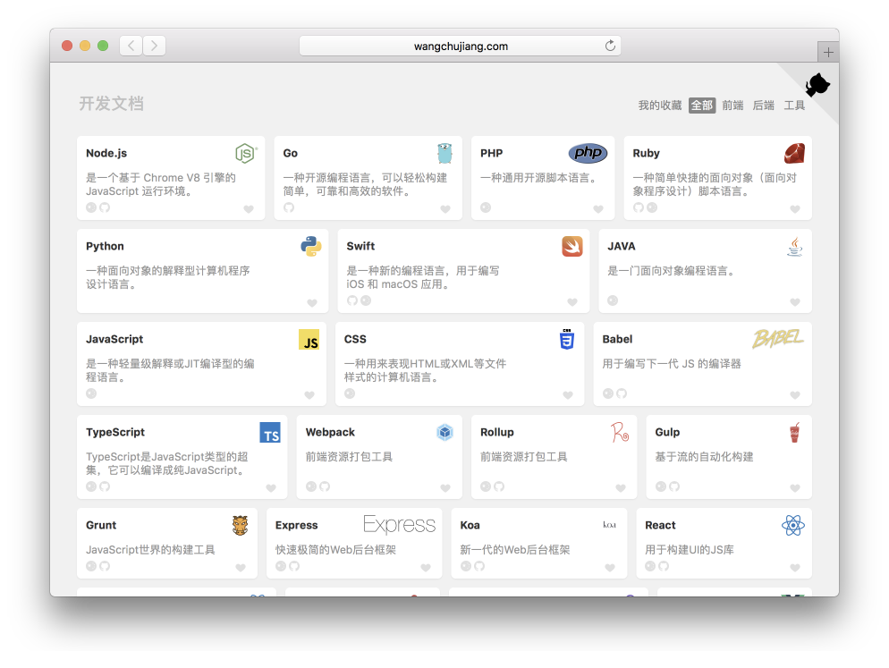

开发者文档网站导航
===

开发者文档网站导航 https://jaywcjlove.github.io/dev-site ，主要是为 Chrome 插件 [oscnews](https://github.com/jaywcjlove/oscnews) 收集数据。

  

## 提交数据

将图片放入 `public/icons` 目录中，对应网站其它信息在 [src/document.json](./src/document.json) 中添加，欢迎提交文档网站。